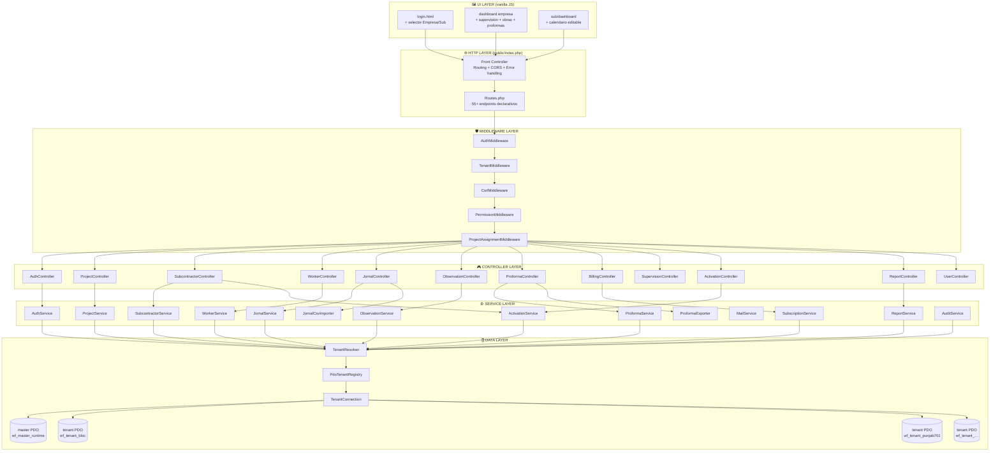
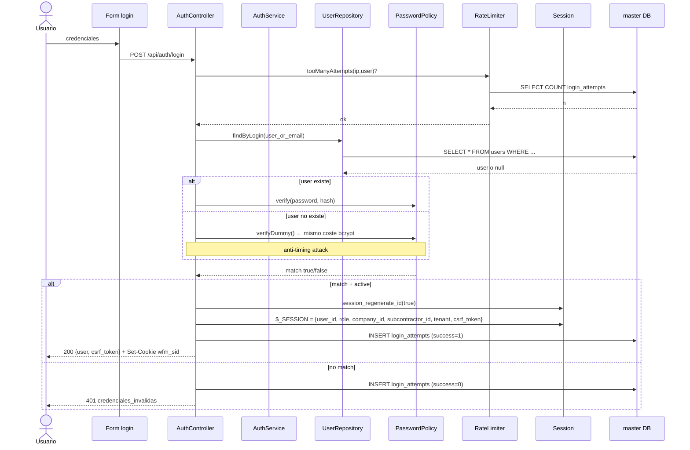
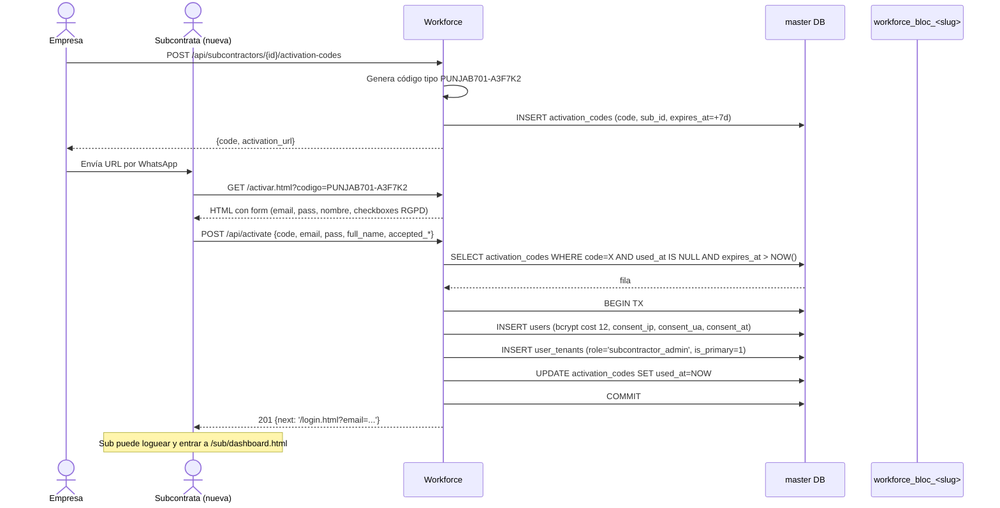
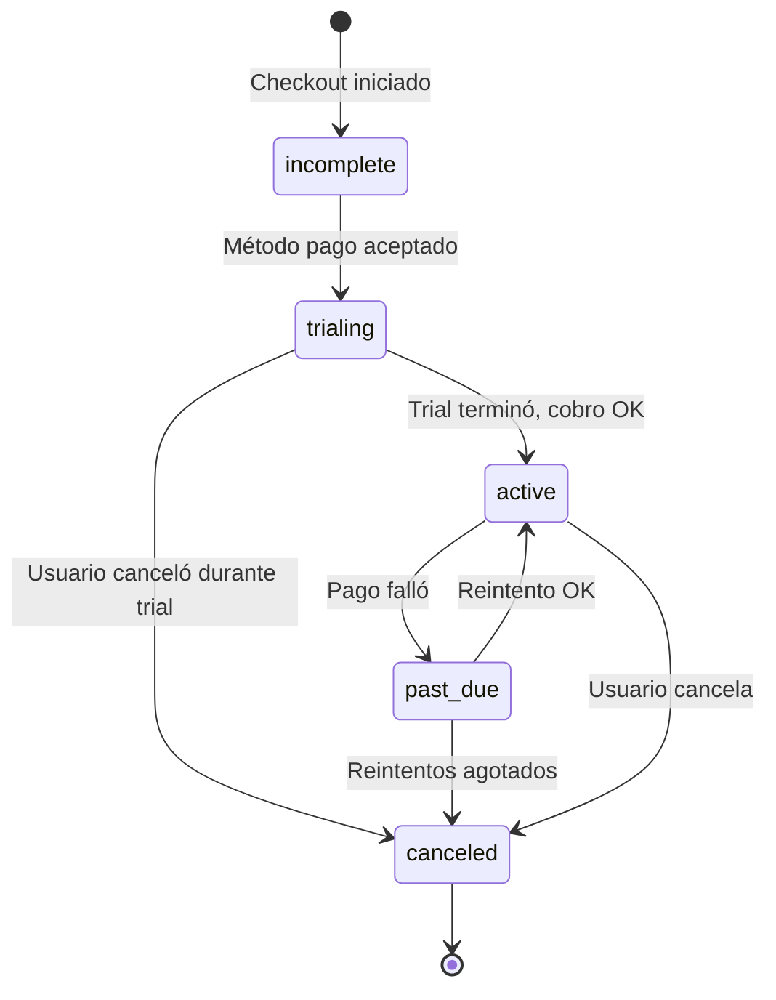
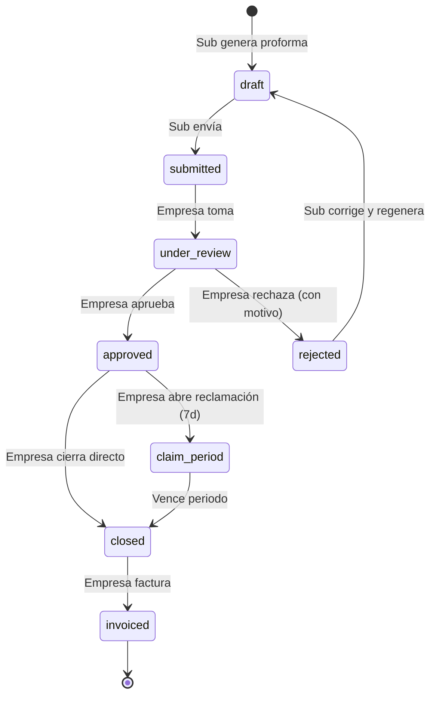

# Arquitectura detallada — Workforce Manager

## Capas lógicas



---

## Resolución tenant (fase crítica de seguridad)

```mermaid
sequenceDiagram
  participant R as Request HTTP
  participant AM as AuthMiddleware
  participant TM as TenantMiddleware
  participant TR as TenantResolver
  participant TPR as PdoTenantRegistry
  participant FS as /etc/workforce/tenants/<slug>.env
  participant SQL as MariaDB

  R->>AM: cookie wfm_sid
  AM->>AM: lee $_SESSION
  AM-->>TM: user autenticado
  TM->>TR: fromAuthenticatedUser(user)
  TR->>TR: lee user.subcontractor_id<br/>(NUNCA de HTTP)
  TR->>TPR: findBySubcontractorId(9)
  TPR->>SQL: SELECT * FROM master.tenant_databases WHERE subcontractor_id=9
  SQL-->>TPR: {database_name, host, port, username}
  TPR->>FS: lee /etc/workforce/tenants/punjab701.env
  FS-->>TPR: TENANT_DB_PASSWORD
  TPR-->>TR: Tenant{slug,dbName,user,pass,...}
  TR-->>TM: Tenant
  TM->>SQL: new PDO(mysql:host=X;dbname=workforce_bloc_punjab701, wf_tenant_punjab701, pass)
  TM->>SQL: SELECT * FROM tenant_meta → verifica fingerprint
  SQL-->>TM: master_subcontractor_id=9 ✓
  TM-->>R: $container->instance('tenant.pdo', $pdo)
  Note over R,SQL: Request continúa con PDO<br/>que solo puede acceder a su BD
```

Si cualquier eslabón falla (sesión inválida, tenant_meta no coincide, fichero .env no legible), la petición aborta con 403/423/404.

---

## Flujo autenticación



---

## Flujo activación por código



---

## Modelo billing — ciclo de vida



El banner UI reacciona a cada estado:
- `trialing + days_until_trial_end ≤ 7` → banner naranja "Tu prueba acaba en N días"
- `past_due` → banner rojo "Pago fallido"
- `canceled` → banner neutro
- `active` → sin banner

---

## Modelo proforma — máquina de estados



Reglas de negocio:
- Si hay observaciones abiertas del mes → `draft→submitted` bloqueado (422)
- Sub NUNCA puede aprobar su propia proforma (hard-deny en PermissionService)
- Las líneas de proforma referencian `source_type='jornal'` + `source_id` para trazabilidad total

---

## Despliegue y entorno

```mermaid
flowchart LR
  subgraph DEV["🧑‍💻 Desarrollo local"]
    DEVPC[gtm-MP100<br/>Apache local<br/>MariaDB local<br/>Vhost workforce.test]
  end

  subgraph GH["💾 GitHub"]
    REPO[Repo privado<br/>workforce-manager]
    REPO2[Repo público<br/>archify docs]
  end

  subgraph HOST["🏢 Hostinger shared"]
    LANDING[work-flow.solutions/workforce/<br/>Landing comercial]
    OFER[/oferta-subcontratas.php]
    PANEL[/workforce/panel/ → redirect 302]
  end

  subgraph PROD["🚀 Producción (VPS futuro)"]
    VPS[Ubuntu 22<br/>Apache + PHP 8.3 + MariaDB<br/>+ wkhtmltopdf + fail2ban + ufw]
  end

  subgraph TUNNEL["☁️ Cloudflare"]
    CT[Cloudflare Tunnel<br/>quick o named]
  end

  DEVPC -->|git push| REPO
  REPO -->|docs| REPO2
  DEVPC -->|rsync deploy.sh| LANDING
  PANEL -.302.-> CT
  CT -.-> DEVPC
  DEVPC -.futuro.-> VPS
  LANDING --> OFER
```

---

## Decisiones arquitectónicas clave

| Decisión | Razón |
|---|---|
| **PHP vanilla sin framework** | Minimizar deuda técnica, control total, menos CVEs, deploy trivial |
| **Multi-tenant físico (BD por sub)** | Aislamiento real: Punjab y Dicotec no se tocan ni por bug SQL |
| **PDO::ATTR_EMULATE_PREPARES=false** | Prepared statements reales, no simulados → inmune a SQL injection |
| **Sin JavaScript framework** | SPAs vanilla, sin node_modules, sin build pipeline |
| **wkhtmltopdf para PDFs** | Resultado profesional vs dompdf; aceptamos binario a cambio |
| **Cloudflare Tunnel para dev público** | Exponer app local a clientes sin VPS temporalmente |
| **Stripe Payment Links primero, Checkout API después** | Validar demanda antes de invertir en integración backend |
| **Blueprint Industrial design system** | Diferenciación visual vs SaaS genéricos azul+verde |

---

## Costes operativos estimados

| Escenario | Mensual | Anual |
|---|---|---|
| Dev local + Cloudflare Tunnel | 0 € | 0 € |
| VPS Hetzner CX22 + dominio | 5,83 € + 1 € | ~82 € |
| VPS Hostinger KVM 2 | 5,99 € | 72 € |
| Fly.io free tier (hasta 2 vms) | 0 € | 0 € |
| Hostinger shared (ya pagado) | 0 € adicional | — |
| Stripe fees | 1,5% + 0,25€ por transacción | — |

Primera suscripción Workforce Subcontratas (48,80 €) paga 8 meses de VPS Hetzner.
