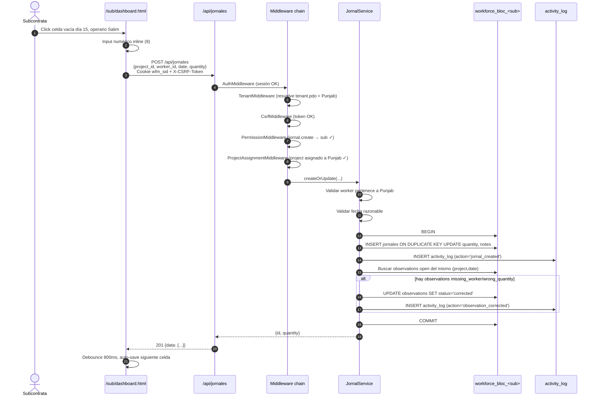
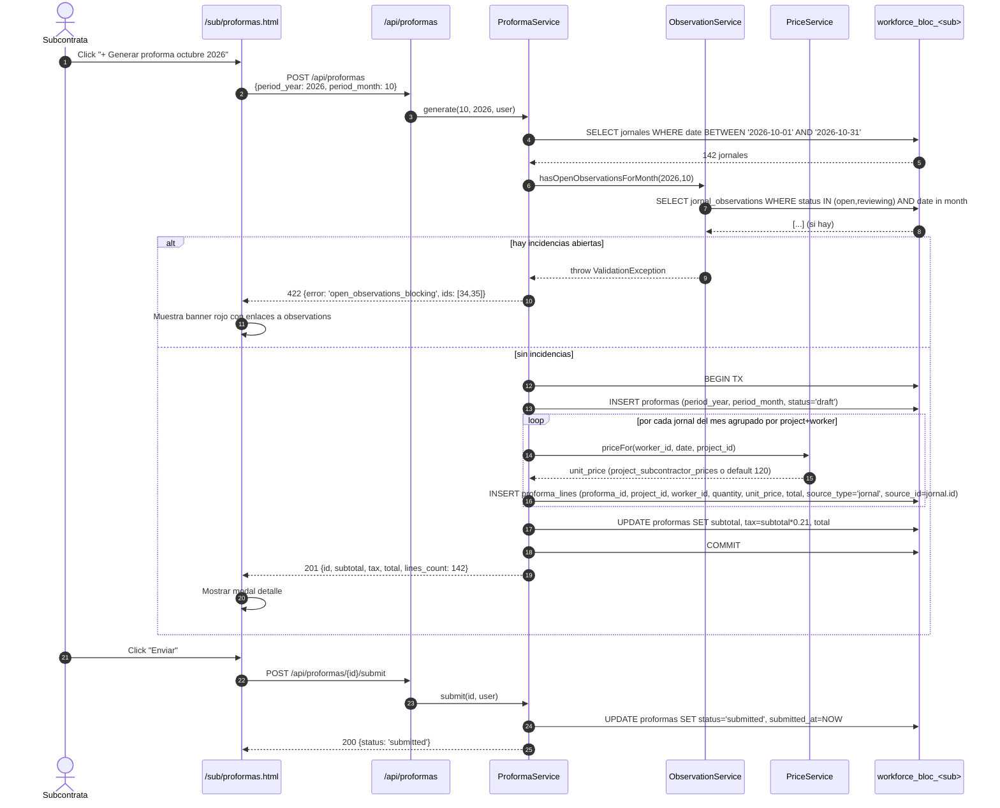
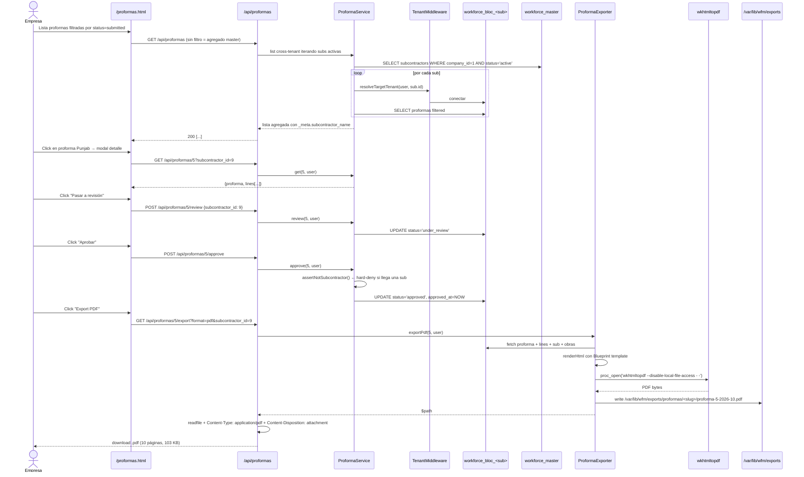
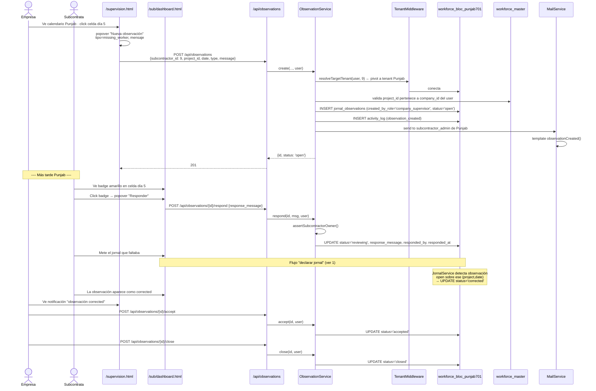
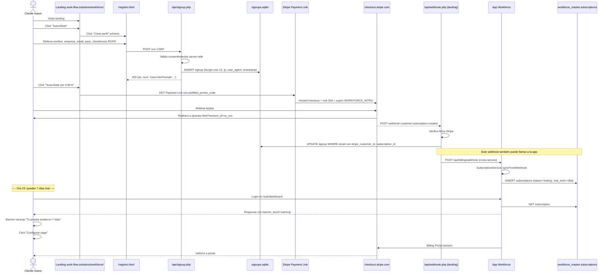
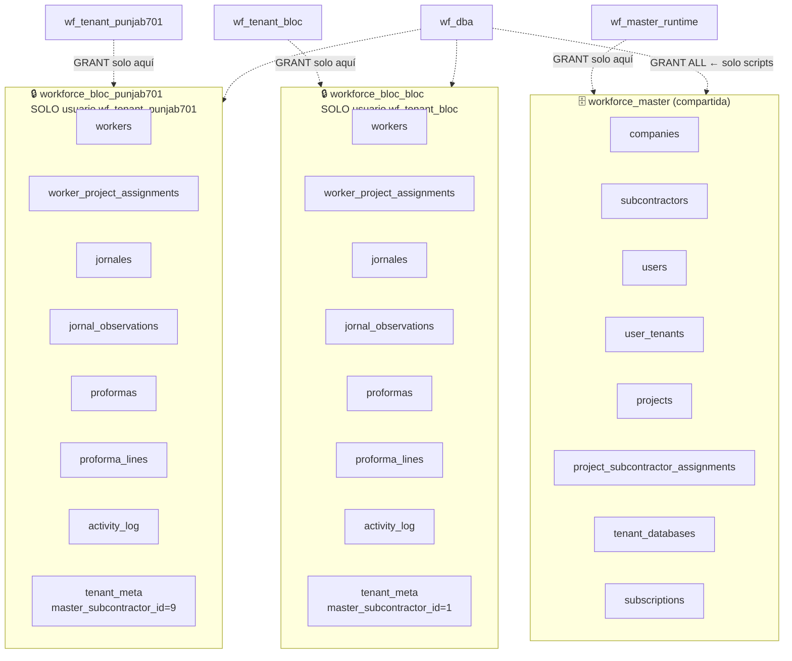

# Flujos de datos — Workforce Manager

## 1. Flujo "declarar jornales día a día"



---

## 2. Flujo "generar proforma mensual"



---

## 3. Flujo "empresa aprueba proforma"



---

## 4. Flujo "observación cross-tenant"



---

## 5. Flujo "signup + billing Stripe"



---

## 6. Flujo "import CSV jornales"

```mermaid
sequenceDiagram
  actor S as Subcontrata
  participant UI as /sub/dashboard.html
  participant API as /api/jornales/import
  participant JCI as JornalCsvImporter
  participant WS as WorkerService
  participant JS as JornalService
  participant T as workforce_bloc_<sub>

  S->>UI: Click [Importar CSV]
  UI->>UI: Modal con descarga plantilla + file input
  S->>UI: Selecciona archivo.csv + project_id
  UI->>API: POST multipart (file + project_id + X-CSRF)
  API->>JCI: import(file, project_id, user)
  JCI->>JCI: Valida tamaño ≤ 2MB
  JCI->>JCI: finfo MIME = text/csv
  JCI->>JCI: Convertir latin1 → UTF-8 si procede
  JCI->>JCI: strip BOM UTF-8
  JCI->>JCI: autodetect separador ; o ,
  JCI->>JCI: Parse header obligatorio
  loop por cada fila (max 1000)
    JCI->>T: SELECT worker WHERE document_number=X AND subcontractor_id=mi_sub
    alt no existe
      JCI->>WS: create(first_name, last_name, document_number, category='oficial')
      WS->>T: INSERT workers
      JCI->>JCI: created_workers++
    end
    JCI->>T: SELECT worker_project_assignments WHERE worker_id=X AND project_id=Y
    alt no asignado
      JCI->>T: INSERT worker_project_assignments
    end
    JCI->>JS: createOrUpdate(project_id, worker_id, date, quantity, notes, user)
    JS->>T: INSERT jornales ON DUPLICATE KEY UPDATE
    alt fila con error
      JCI->>JCI: errors[] += {row, reason}
    else ok
      JCI->>JCI: imported++
    end
  end
  JCI-->>API: {imported, skipped, errors[], created_workers}
  API-->>UI: 200
  UI->>UI: Toast "Importados X, Y errores"
  UI->>UI: Modal muestra lista errores por fila
```

---

## 7. Aislamiento cross-tenant visualizado



**Clave**: `wf_tenant_punjab701` no existe desde la perspectiva de `BLOC`. Si una query intentara `SELECT * FROM workforce_bloc_bloc.workers` desde el PDO de Punjab, MariaDB respondería `Access denied for user 'wf_tenant_punjab701'@'127.0.0.1' to database 'workforce_bloc_bloc'`.

El fingerprint `tenant_meta.master_subcontractor_id` es una segunda capa: aunque alguien swapeara credenciales por error (ej. apuntar Punjab a la BD de BLOC), la app verifica que la BD contiene el ID esperado y aborta con `TenantMismatchException`.
