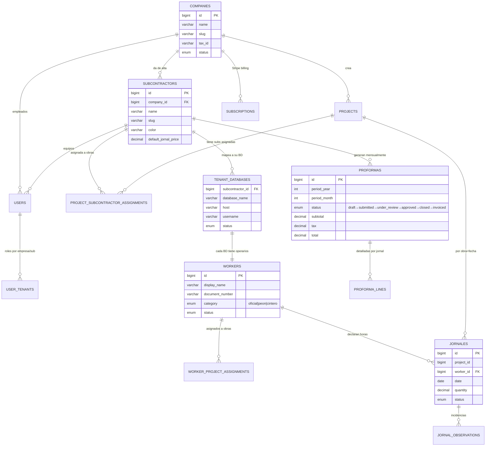
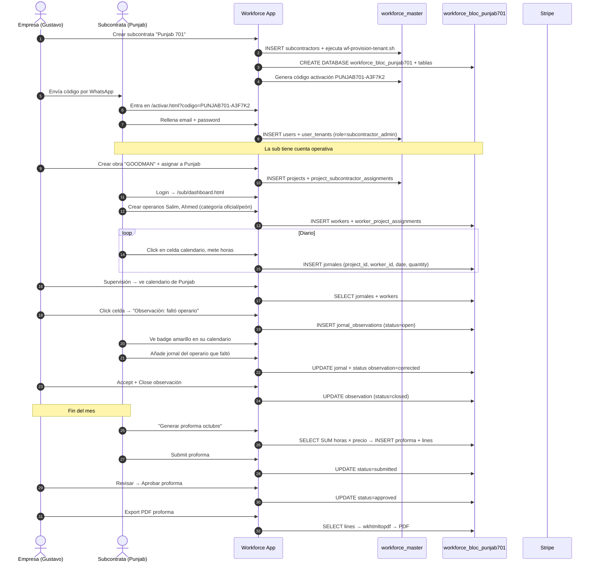
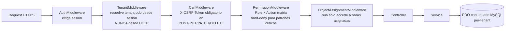

# Archify — Workforce Manager

Documentación arquitectónica de **Workforce Manager**, el SaaS multi-tenant de **Workflow Cloud** para que empresas constructoras supervisen jornales, incidencias y proformas de sus subcontratas.

- Repo principal (código): privado
- Landing comercial: https://work-flow.solutions/workforce/
- Oferta subcontratas: https://work-flow.solutions/workforce/oferta-subcontratas.php
- Panel app (actual, vía Cloudflare Tunnel): https://work-flow.solutions/workforce/panel/

---

## 1. ¿Qué es Workforce Manager?

Un sistema que separa radicalmente **Empresa Principal** (constructora) y sus **Subcontratas** (equipos de obra). Cada subcontrata trabaja con sus propios operarios y jornales en una base de datos aislada; la empresa supervisa en modo lectura, levanta incidencias y aprueba proformas mensuales.

### Actores

- **Empresa Principal** (ej. Bloc Creatiu SL): crea obras, da de alta subcontratas, supervisa jornales, aprueba proformas.
- **Subcontrata** (ej. Punjab 701, BLOC, Dicotec): declara operarios, mete jornales día a día, responde incidencias, genera proformas.

---

## 2. Arquitectura — vista general

```mermaid
flowchart TB
  subgraph Browser["🌐 Navegador cliente"]
    LA[Landing comercial<br/>work-flow.solutions/workforce]
    UI[App SPA<br/>login + dashboard + calendario]
  end

  subgraph Hostinger["🏢 Hostinger shared (público)"]
    H1[landing HTML/PHP]
    H2[Stripe Payment Links<br/>signup PHP + webhook]
    H3[SQLite signups]
  end

  subgraph CF["☁️ Cloudflare"]
    CT[Cloudflare Tunnel<br/>o Named Tunnel]
  end

  subgraph VPS["💻 Servidor Workforce (local hoy, VPS mañana)"]
    AP[Apache 2.4 + PHP 8.3]
    FC[Front Controller<br/>public/index.php]
    MW[Middleware chain:<br/>Auth → Tenant → CSRF → Permission → ProjectAssignment]
    SV[Services<br/>Project · Worker · Jornal · Observation · Proforma · Billing]
    subgraph DB["🗄️ MariaDB 10.11"]
      DBM[(workforce_master)]
      DBT1[(workforce_bloc_bloc)]
      DBT2[(workforce_bloc_punjab701)]
      DBT3[(workforce_bloc_...)]
    end
    FS[Filesystem<br/>/etc/workforce/*.env<br/>/var/lib/wfm/exports]
    WK[wkhtmltopdf]
  end

  subgraph Stripe["💳 Stripe LIVE"]
    SP[Products · Prices · Coupons]
    SH[Webhook events]
  end

  LA -->|HTTPS| H1
  LA -->|click "Entrar al panel"| CT
  CT -->|QUIC tunnel| AP
  UI -->|fetch /api/*| CT
  AP --> FC --> MW --> SV
  SV -->|wf_master_runtime| DBM
  SV -->|wf_tenant_bloc| DBT1
  SV -->|wf_tenant_punjab701| DBT2
  SV -->|wf_tenant_...| DBT3
  SV --> FS
  SV --> WK
  H2 -->|Payment Link| SP
  SH -->|checkout.session.completed<br/>invoice.paid<br/>subscription.updated| CT
  CT -->|/api/billing/webhook| AP
```

### Principio clave — aislamiento multi-tenant físico

Cada subcontrata tiene **su propia base de datos** con **su propio usuario MySQL**. No comparten tabla, no comparten usuario, no comparten GRANTS. Si un bug SQL dejara entrar código ajeno, el usuario `wf_tenant_punjab701` ni siquiera **ve** la base de datos de BLOC — a nivel de permisos MySQL no existe para él.

| Base de datos | Dueño | Contiene |
|---|---|---|
| `workforce_master` | `wf_master_runtime` | Empresas, subcontratas, usuarios, obras, mapeo tenant→BD, roles, permisos |
| `workforce_bloc_bloc` | `wf_tenant_bloc` | Operarios + jornales + proformas + incidencias **solo de BLOC** |
| `workforce_bloc_punjab701` | `wf_tenant_punjab701` | Idem **solo de Punjab 701** |
| … 12 más | 1 usuario dedicado cada una | — |

---

## 3. Modelo de datos — ERD



---

## 4. Flujo mensual end-to-end



---

## 5. Capas de seguridad



**Hard-denies clave**:
- Master nunca puede `jornal.update` (solo lectura + observación)
- Subcontrata nunca puede `proforma.approve` (es la empresa quien aprueba)
- Subcontratista nunca puede acceder a otra sub (ni con `?subcontractor_id=X` en query)

---

## 6. Flujo billing — modelo introductorio

```mermaid
flowchart TB
  C[Cliente nuevo] -->|clic "Suscríbete"| PL[Stripe Payment Link]
  PL -->|Checkout con<br/>trial_period_days=30<br/>+ WORKFORCE_INTRO -39.90€/3m| ST[Stripe]
  ST -->|customer.subscription.created| WH[Webhook<br/>/api/billing/webhook]
  WH --> SUB[(subscriptions)]
  SUB -->|status=trialing<br/>trial_end=+30d| M[(workforce_master)]
  M -->|days_until_trial_end| UI[Banner UI<br/>naranja si ≤7 días]
  UI -->|clic "Configurar pago"| PORTAL[Stripe Billing Portal]

  SUB -->|día 30| COBRO1[Cobro 9,90€<br/>cupón WORKFORCE_INTRO mes 1/3]
  SUB -->|día 60| COBRO2[Cobro 9,90€ mes 2/3]
  SUB -->|día 90| COBRO3[Cobro 9,90€ mes 3/3]
  SUB -->|día 120+| COBRO4[Cobro 48,80€ precio normal]
```

---

## 7. Stack técnico

| Capa | Tecnología | Versión |
|---|---|---|
| Backend | PHP | 8.3 |
| Base de datos | MariaDB | 10.11 |
| Web server | Apache 2.4 + mod_rewrite + mod_ssl | 2.4.58 |
| Frontend | HTML5 + CSS vanilla + JS vanilla | ES2020 |
| PDF | wkhtmltopdf | 0.12.6 |
| Testing | PHPUnit | 10.5 |
| Pagos | Stripe PHP SDK | 16.2 |
| Tunnel | Cloudflare Tunnel | 2026.3 |

**Sin frameworks** (ni Laravel ni Symfony). PHP vanilla con PSR-4 autoload y PDO prepared statements.

---

## 8. Métricas actuales (producción local)

| Métrica | Valor |
|---|---|
| Empresas (companies) | 2 |
| Subcontratas activas | 14 |
| Operarios | 50+ |
| Obras (projects) | 222 |
| Jornales históricos | 1.750 |
| Tests PHPUnit | 148 passing |
| Líneas de código PHP | ~15.000 |
| Páginas UI | 20 |
| Endpoints API | 55+ |

---

## 9. Despliegue

### Opción A — VPS Ubuntu 22+ (recomendada producción)
```bash
ssh root@IP_VPS
git clone <repo> workforce-manager
cd workforce-manager/deploy/vps
./install.sh --domain workforce.workflow-cloud.com --email admin@workflow-cloud.com
```
Instala Apache + MariaDB + PHP + wkhtmltopdf + Let's Encrypt + ufw + fail2ban + backup diario en **10-15 min**.

### Opción B — Docker
```bash
cd deploy/docker
cp .env.example .env && nano .env
docker compose up -d
```

### Opción C — Cloudflare Tunnel desde PC local (actual)
```bash
cloudflared tunnel --url https://localhost:443 --no-tls-verify --http-host-header workforce.test
```

---

## 10. Documentación relacionada

- `docs/CURRENT_ARCHITECTURE.md` — estado del código legacy heredado (jornales.test)
- `docs/TARGET_ARCHITECTURE.md` — arquitectura objetivo
- `docs/TENANT_ARCHITECTURE.md` — modelo multi-tenant detallado
- `docs/SECURITY.md` — modelo de amenazas + controles
- `docs/ROLES_AND_PERMISSIONS.md` — matriz roles × acciones
- `docs/JOURNAL_FLOW.md` — flujo jornal + observaciones
- `docs/PROFORMA_FLOW.md` — flujo proforma mensual

---

## 11. Licencia

Propietario · Workflow Cloud LLC · Delaware, USA · 2026.

Workforce Manager es software privado. Esta documentación arquitectónica se publica como referencia bajo [CC BY-NC-SA 4.0](https://creativecommons.org/licenses/by-nc-sa/4.0/).
