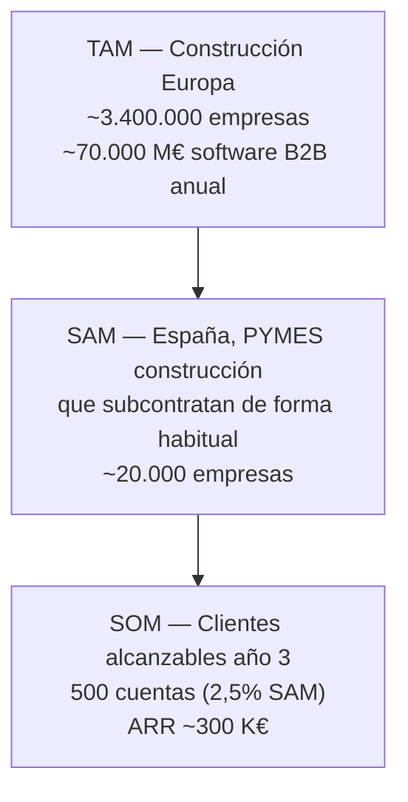

# Análisis de mercado — Workforce Manager

## 1. Dimensionamiento TAM / SAM / SOM



### TAM — Total Addressable Market

- **España**: 140.000 empresas registradas en el sector construcción (INE, DIRCE 2024).
- **Europa**: ~3,4 M de empresas de construcción (Eurostat, SBS 2023).
- **Gasto software B2B construcción EU**: ~70.000 M€ anuales (datos Statista 2024, incluye BIM, ERP, HR, campo-oficina).
- Segmento relevante (gestión jornales + nómina + supervisión obra): ~5 % del gasto software = **~3.500 M€/año**.

### SAM — Serviceable Addressable Market

Filtro realista para Workforce Manager (España, año 1-3):

- Constructoras **10-250 empleados** = ~20.000 empresas.
- De estas, las que **subcontratan 3+ equipos** de forma recurrente = ~15.000-18.000.
- Idioma español nativo + categorías legales españolas (oficial, peón, cintero, encargado) = **~18.000 cuentas potenciales**.

Si capturamos un ARPU medio ponderado de 550 €/año:

```
SAM anual = 18.000 × 550 € = 9,9 M€/año
```

### SOM — Serviceable Obtainable Market

Proyección realista año 1-5:

| Año | Clientes | % SAM | ARR |
|---|---|---|---|
| 1 | 50 | 0,28 % | 25 K€ |
| 2 | 200 | 1,1 % | 110 K€ |
| 3 | 500 | 2,8 % | 300 K€ |
| 5 | 2.000 | 11,1 % | 1,2 M€ |

El 11 % de SAM en año 5 es ambicioso pero no delirante: salesforce.com capturó 15 %+ del CRM mid-market US en su propia década inicial. En nichos verticales la penetración puede ir más rápido por boca-oreja sectorial.

---

## 2. Expansión geográfica (opcional, año 3+)

| País | Empresas construcción | Encaje del producto |
|---|---|---|
| España | 140.000 | Mercado base, 100 % encaje |
| Portugal | 55.000 | Idioma + legislación laboral similar, 85 % |
| México | 95.000 (grandes zonas urbanas) | Español + categorías obrero traducibles, 70 % |
| Argentina | 48.000 | Español + sistema similar, 70 % |
| Francia | 420.000 | Traducción + categorías propias, 50 % |

Prioridad: España primero, Portugal + Latam año 3+.

---

## 3. Perfil de cliente ideal (ICP)

### Constructora principal (buyer tipo 1)

- **Ubicación**: Cataluña, Comunidad Valenciana, Madrid, Andalucía.
- **Tamaño**: 10-100 empleados en plantilla.
- **Facturación**: 1-15 M€/año.
- **Modelo operativo**: trabaja con 3-15 subcontratas simultáneas (albañilería, pladur, estructura, instalaciones).
- **Jefe de obra actual**: usa Excel + WhatsApp + papel para cuadrar jornales.
- **Pain points**:
  - Discrepancias mensuales con las proformas de las subs.
  - Cero visibilidad en tiempo real de qué operario está en qué obra.
  - Imposible auditar cuando hay dudas (quién faltó, qué día, por qué).
- **Decisión**: compra el gerente o el jefe de obra senior, no un comité.
- **Precio target**: 39-89 €/mes aceptable, > 150 €/mes bloquea decisión.

### Subcontrata (buyer tipo 2)

- **Tipo**: equipo de obra de 3-20 operarios con un responsable administrativo.
- **Facturación**: 100 K€-2 M€/año.
- **Trabaja para**: 1-5 constructoras principales.
- **Pain points**:
  - Hace proformas a mano o en Excel; errores de cuenta frecuentes.
  - La constructora rechaza proformas por discrepancias → paga tarde.
  - Operarios distintos cada día; difícil llevar la cuenta.
- **Compra**: a petición de la constructora (que ya es cliente) o por propia iniciativa.
- **Precio target**: 14-48 €/mes aceptable.

### Autónomo (buyer tipo 3)

- **Tipo**: 1 operario que factura por horas a 1-2 constructoras.
- **Volumen**: 1-2 obras simultáneas.
- **Pain**: necesita demostrar sus horas con registro profesional.
- **Precio target**: 10-15 €/mes.

---

## 4. Pain points cuantificados

| Problema | Impacto medido |
|---|---|
| Tiempo semanal cuadrando jornales (jefe de obra) | 8-12 horas |
| Discrepancias en proforma mensual | 5-15 % de las líneas |
| Días de retraso en cobro por disputa | 20-45 días |
| Coste de implantación ERP sectorial tradicional | 15.000-40.000 € |
| Horas setup de software HR genérico (Factorial, etc.) | 20-50 horas |
| % constructoras PYMES sin software específico (2024) | 70-85 % |

Si un jefe de obra ahorra 6 h/semana × 4 semanas × 40 €/h = **960 €/mes** recuperados. Precio del plan Workforce Subcontratas (48,80 €) representa el 5 % de ese ahorro. ROI inmediato.

---

## 5. Tendencias de mercado

- **Digitalización forzada post-COVID**: el sector construcción fue el que más tarde digitalizó. 2023-2026 ha visto una ola de adopción de software móvil para jefes de obra.
- **Kit Digital (España)**: fondos públicos cubren hasta 12.000 € para software SaaS en PYMES. Workforce Manager cualifica.
- **Movimiento de cumplimiento laboral**: inspecciones de trabajo cada vez más exigentes con registro de jornada. La trazabilidad digital pasa de "deseable" a "legal".
- **Escasez de mano de obra**: las constructoras valoran retener operarios buenos; un registro limpio de horas y pagos ayuda a esa fidelización.
- **Reducción de márgenes**: tras 2024, las constructoras medianas sienten presión; cualquier herramienta que recupere 1 % de margen es viable.

---

## 6. Barreras de entrada para competidores

- **Multi-tenant físico**: ningún ERP generalista va a reescribir su arquitectura para 1 BD/cliente. Es un lock-in arquitectónico irreversible una vez elegido lógico.
- **Nicho construcción española**: Factorial/Sesame/Personio son HR genéricos; no van a pivotar a construcción.
- **Precio imbatible**: a 9,90 €/mes introductorio y 48,80 €/mes recurrente, ningún competidor serio puede bajar sin canibalizar su core.
- **Vocabulario sectorial**: "oficial", "peón", "cintero", "proforma", "jornal" — los competidores extranjeros nunca lo tienen nativo.

---

## 7. Riesgos de mercado

- **Riesgo 1**: la digitalización del sector es más lenta de lo previsto. Mitigación: boca-oreja, red Bloc Creatiu, Kit Digital.
- **Riesgo 2**: un competidor local (ej. una gestoría grande) construye algo parecido. Mitigación: velocidad de iteración, aislamiento físico defendible, precio.
- **Riesgo 3**: cambio regulatorio obliga a certificación específica (ej. firma electrónica avanzada en proformas). Mitigación: ya se prevé integración con firma digital Q3 2027.
- **Riesgo 4**: dependencia de Stripe. Mitigación: alternativa Redsys documentada; migración viable en 1 mes si fuese necesario.
