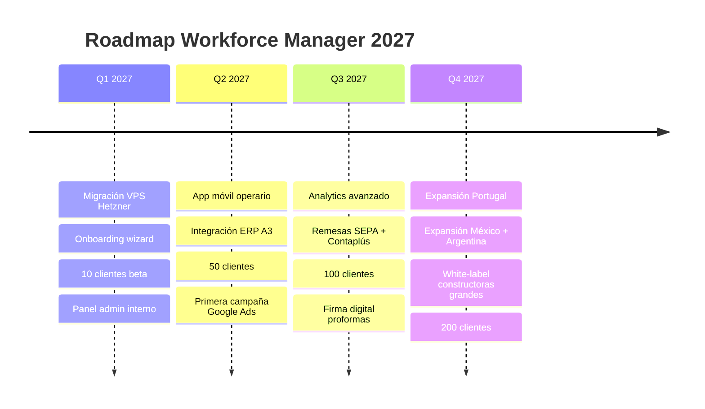

# Roadmap 12 meses — Workforce Manager

> Horizonte: Q1 2027 → Q4 2027. Hitos trimestrales con criterio de éxito explícito.

---

## Q1 2027 — Estabilizar y vender a los primeros 10

### Hitos

- **Migración VPS Hetzner CX22** definitiva. Cloudflare Tunnel pasa a solo dev local.
- **Onboarding wizard** post-signup: crear primera obra + primera sub + primer operario en 5 clicks.
- **Panel admin interno** (`/admin/`) para monitorizar tenants, suscripciones, errores.
- **10 clientes beta** (red Bloc Creatiu, Barcelona + Valencia).
- **Documentación cliente final** (manual PDF, 10 páginas, imprimible).

### Técnicas

- `install.sh` idempotente verificado en 3 VPS distintos.
- Backup automático cifrado a S3 (restic + Backblaze B2).
- Monitoring UptimeRobot + healthchecks.io.
- Logs sanitizados (passwords/tokens masked).

### Criterio de éxito

- 10 constructoras activas con al menos 1 proforma generada.
- SLA uptime 99,5 %.
- 0 incidentes de seguridad.

---

## Q2 2027 — Movilidad y primeras 50

### Hitos

- **App móvil operario** (Capacitor o React Native): el operario declara horas desde el móvil, sincroniza con la sub al llegar WiFi.
- **Integración ERP A3**: exportación de proformas aprobadas en formato A3 nativo (CSV + mapeo).
- **50 clientes** acumulados.
- **Primera campaña Google Ads** controlada (presupuesto 2.000 €/mes, keywords nicho).

### Técnicas

- API endpoint `/api/mobile/*` con JWT para app móvil.
- Modo offline-first en la app móvil.
- Export A3 testeado con gestoría real.
- Cache tenant.pdo con Redis (opcional, si volumen lo requiere).

### Criterio de éxito

- 50 clientes activos.
- Al menos 20 % usando app móvil mensualmente.
- CAC < 100 €.
- MRR > 2.000 €.

---

## Q3 2027 — Analytics, pagos y 100 clientes

### Hitos

- **Analytics avanzado**: dashboard ejecutivo con comparativas interanuales, forecasting horas/mes.
- **Remesas SEPA**: generación de fichero XML SEPA directo desde proformas aprobadas.
- **Exportación Contaplús**: formato CSV compatible para que gestorías lo importen directo.
- **Firma digital integrada**: proformas con firma electrónica avanzada (acuerdo con FirmaProfesional o similar).
- **100 clientes** acumulados.

### Técnicas

- Reportes PDF con gráficos (ApexCharts o Chart.js server-side rendering).
- SEPA XML según norma AEB-19.14.
- Integración firma digital con API externa (coste 0,50-1 €/firma).
- Internacionalización código base (i18n groundwork para Q4).

### Criterio de éxito

- 100 clientes activos.
- Al menos 10 % en plan Pro (89 €).
- NPS > 40.
- ARR > 55.000 €.

---

## Q4 2027 — Expansión internacional y white-label

### Hitos

- **Portugal**: traducción PT-PT + aceptar NIF portugués + legislación laboral local verificada.
- **México**: traducción MX + RFC + categorías obreras locales (oficial, ayudante, cabo).
- **Argentina**: CUIT + ARS como moneda alternativa + categorías UOCRA.
- **White-label constructoras grandes**: dominio propio, logo custom, email transaccional desde dominio cliente.
- **200 clientes** acumulados.

### Técnicas

- Multi-idioma vía gettext + archivos `.po` para ES/PT/EN.
- Soporte multi-currency en Stripe (EUR, MXN, ARS, USD).
- CNAME dinámico + Let's Encrypt wildcard para white-labels.
- Rediseño landing con selector país.

### Criterio de éxito

- 200 clientes activos.
- Al menos 10 clientes fuera de España.
- 2 white-labels activos.
- ARR > 110.000 €.
- Equipo: fundador + 1 developer + 1 comercial.

---

## Backlog priorizado (no incluido en los 12 meses)

Features que están roadmap medio plazo pero no cerradas aún:

- Integración WhatsApp Business API: notificaciones automáticas de incidencias.
- Fichaje por geolocalización desde app móvil (opt-in).
- OCR de albaranes materiales → asociación obra automática.
- Firma manuscrita en tablet para proformas presenciales.
- Chat interno empresa ↔ sub (reemplaza WhatsApp disperso).
- Marketplace de operarios temporales entre subcontratas.
- API pública con rate limiting y OAuth2.
- Integración con software BIM (Revit, ArchiCAD) para extracción partidas.
- Modo auditor externo (role sólo lectura + export completo).
- Firma biométrica en app móvil.

El orden de este backlog se revisa cada trimestre con feedback real de los primeros 100 clientes.

---

## Decisiones explícitas que NO están en roadmap

Para evitar scope creep y mantener foco:

- **No construimos nómina**. Dejamos a la gestoría hacer la nómina con nuestros datos exportados.
- **No construimos CRM**. Factorial, Zoho, HubSpot ya lo hacen bien.
- **No construimos facturación completa**. Proforma sí (es el núcleo), factura final la hace la gestoría.
- **No construimos ERP material/compras**. Se puede integrar con otros pero no es core.
- **No competimos con BIM**. Es otro universo.

Mantener producto estrecho y profundo es nuestra ventaja frente a Odoo-generalistas.
