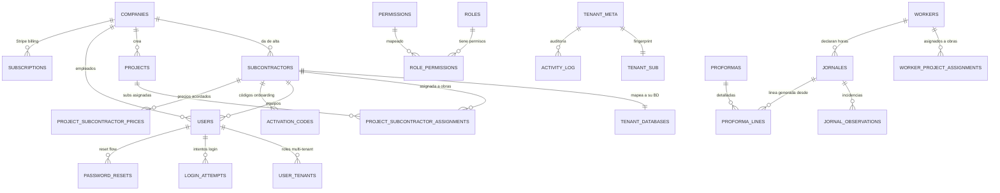

# Base de datos — Workforce Manager

## 1. Arquitectura general

Dos planos de bases de datos:

- **`workforce_master`** — una sola instancia, compartida. Contiene empresas, subcontratas, usuarios, obras, mapeo tenant→BD, roles, permisos, suscripciones Stripe.
- **`workforce_bloc_<slug>`** — una base de datos **por cada subcontrata**. Contiene operarios, jornales, observaciones, proformas, líneas de proforma y log de actividad **solo de esa subcontrata**.

Cada tenant tiene su propio usuario MySQL con GRANTS limitados a su base de datos. El usuario master tiene GRANTS limitados a `workforce_master`.

Motor: **MariaDB 10.11**. Charset: `utf8mb4`. Collation: `utf8mb4_unicode_ci`.

---

## 2. ERD completo



---

## 3. Tablas master (`workforce_master`)

### `companies`

| Columna | Tipo | Nulable | Default | Notas |
|---|---|---|---|---|
| id | BIGINT UNSIGNED | NO | AUTO | PK |
| name | VARCHAR(255) | NO | — | "Bloc Creatiu SL" |
| slug | VARCHAR(100) | NO | — | UNIQUE, "bloc" |
| tax_id | VARCHAR(50) | SI | NULL | NIF/CIF |
| email | VARCHAR(255) | SI | NULL | contacto |
| phone | VARCHAR(50) | SI | NULL | |
| status | ENUM('active','suspended','cancelled') | NO | 'active' | |
| settings_json | JSON | SI | NULL | preferencias UI |
| created_at | TIMESTAMP | NO | CURRENT | |
| updated_at | TIMESTAMP | NO | CURRENT ON UPDATE | |

### `subcontractors`

| Columna | Tipo | Nulable | Default | Notas |
|---|---|---|---|---|
| id | BIGINT UNSIGNED | NO | AUTO | PK |
| company_id | BIGINT UNSIGNED | NO | — | FK → companies(id) RESTRICT |
| name | VARCHAR(255) | NO | — | "Punjab 701" |
| slug | VARCHAR(100) | NO | — | UNIQUE per company |
| color | VARCHAR(7) | SI | NULL | "#FF6B6B" tag color |
| default_jornal_price | DECIMAL(10,2) | NO | 120.00 | precio hora base |
| tax_id | VARCHAR(50) | SI | NULL | |
| contact_name | VARCHAR(255) | SI | NULL | |
| contact_email | VARCHAR(255) | SI | NULL | |
| status | ENUM('active','inactive','suspended') | NO | 'active' | |
| notes | TEXT | SI | NULL | |
| created_at | TIMESTAMP | NO | CURRENT | |
| updated_at | TIMESTAMP | NO | CURRENT ON UPDATE | |

Índice: `(company_id, slug)` UNIQUE.

### `tenant_databases`

| Columna | Tipo | Nulable | Default | Notas |
|---|---|---|---|---|
| subcontractor_id | BIGINT UNSIGNED | NO | — | PK, FK → subcontractors(id) CASCADE |
| database_name | VARCHAR(100) | NO | — | "workforce_bloc_punjab701" |
| host | VARCHAR(255) | NO | '127.0.0.1' | |
| port | INT | NO | 3306 | |
| username | VARCHAR(80) | NO | — | "wf_tenant_punjab701" |
| status | ENUM('provisioning','active','suspended','archived') | NO | 'provisioning' | |
| provisioned_at | TIMESTAMP | SI | NULL | |
| created_at | TIMESTAMP | NO | CURRENT | |

### `projects`

| Columna | Tipo | Nulable | Default | Notas |
|---|---|---|---|---|
| id | BIGINT UNSIGNED | NO | AUTO | PK |
| company_id | BIGINT UNSIGNED | NO | — | FK → companies(id) RESTRICT |
| name | VARCHAR(255) | NO | — | "GOODMAN" |
| code | VARCHAR(50) | SI | NULL | código interno constructora |
| address | VARCHAR(500) | SI | NULL | |
| status | ENUM('active','paused','closed','archived') | NO | 'active' | |
| start_date | DATE | SI | NULL | |
| end_date | DATE | SI | NULL | |
| notes | TEXT | SI | NULL | |
| created_at | TIMESTAMP | NO | CURRENT | |
| updated_at | TIMESTAMP | NO | CURRENT ON UPDATE | |

### `project_subcontractor_assignments`

| Columna | Tipo | Nulable | Default | Notas |
|---|---|---|---|---|
| id | BIGINT UNSIGNED | NO | AUTO | PK |
| project_id | BIGINT UNSIGNED | NO | — | FK → projects(id) CASCADE |
| subcontractor_id | BIGINT UNSIGNED | NO | — | FK → subcontractors(id) CASCADE |
| assigned_at | TIMESTAMP | NO | CURRENT | |
| unassigned_at | TIMESTAMP | SI | NULL | NULL = asignación activa |

Índice: `(project_id, subcontractor_id)` UNIQUE WHERE unassigned_at IS NULL.

### `project_subcontractor_prices`

Precios acordados específicos por obra+sub (overrides default_jornal_price).

| Columna | Tipo | Nulable | Default | Notas |
|---|---|---|---|---|
| id | BIGINT UNSIGNED | NO | AUTO | PK |
| project_id | BIGINT UNSIGNED | NO | — | FK → projects(id) |
| subcontractor_id | BIGINT UNSIGNED | NO | — | FK → subcontractors(id) |
| category | ENUM('oficial','peon','cintero','encargado') | SI | NULL | NULL = aplica a todas |
| unit_price | DECIMAL(10,2) | NO | — | precio hora |
| valid_from | DATE | NO | — | |
| valid_to | DATE | SI | NULL | NULL = indefinido |
| created_at | TIMESTAMP | NO | CURRENT | |

Índice: `(project_id, subcontractor_id, category, valid_from)` UNIQUE.

### `users`

| Columna | Tipo | Nulable | Default | Notas |
|---|---|---|---|---|
| id | BIGINT UNSIGNED | NO | AUTO | PK |
| email | VARCHAR(255) | NO | — | UNIQUE |
| password_hash | VARCHAR(255) | NO | — | bcrypt cost 12 |
| full_name | VARCHAR(255) | NO | — | |
| status | ENUM('active','suspended','deleted') | NO | 'active' | |
| last_login_at | TIMESTAMP | SI | NULL | |
| consent_ip | VARCHAR(45) | SI | NULL | RGPD |
| consent_ua | TEXT | SI | NULL | RGPD |
| consent_at | TIMESTAMP | SI | NULL | RGPD |
| accepted_terms | TINYINT(1) | NO | 0 | |
| accepted_privacy | TINYINT(1) | NO | 0 | |
| created_at | TIMESTAMP | NO | CURRENT | |
| updated_at | TIMESTAMP | NO | CURRENT ON UPDATE | |

### `user_tenants`

| Columna | Tipo | Nulable | Default | Notas |
|---|---|---|---|---|
| id | BIGINT UNSIGNED | NO | AUTO | PK |
| user_id | BIGINT UNSIGNED | NO | — | FK → users(id) CASCADE |
| company_id | BIGINT UNSIGNED | SI | NULL | FK → companies(id) |
| subcontractor_id | BIGINT UNSIGNED | SI | NULL | FK → subcontractors(id) |
| role | ENUM('company_admin','company_supervisor','subcontractor_admin','subcontractor_user') | NO | — | |
| is_primary | TINYINT(1) | NO | 0 | tenant por defecto al login |
| created_at | TIMESTAMP | NO | CURRENT | |

CHECK: `(company_id IS NOT NULL AND subcontractor_id IS NULL) OR (company_id IS NULL AND subcontractor_id IS NOT NULL)`.

### `activation_codes`

| Columna | Tipo | Nulable | Default | Notas |
|---|---|---|---|---|
| id | BIGINT UNSIGNED | NO | AUTO | PK |
| subcontractor_id | BIGINT UNSIGNED | NO | — | FK |
| code | VARCHAR(50) | NO | — | UNIQUE, "PUNJAB701-A3F7K2" |
| expires_at | TIMESTAMP | NO | — | +7 días por defecto |
| used_at | TIMESTAMP | SI | NULL | NULL = disponible |
| used_by_user_id | BIGINT UNSIGNED | SI | NULL | FK → users(id) |
| created_at | TIMESTAMP | NO | CURRENT | |

### `subscriptions`

| Columna | Tipo | Nulable | Default | Notas |
|---|---|---|---|---|
| id | BIGINT UNSIGNED | NO | AUTO | PK |
| company_id | BIGINT UNSIGNED | SI | NULL | FK → companies(id) |
| subcontractor_id | BIGINT UNSIGNED | SI | NULL | FK → subcontractors(id) |
| stripe_customer_id | VARCHAR(100) | NO | — | |
| stripe_subscription_id | VARCHAR(100) | NO | — | UNIQUE |
| plan_code | VARCHAR(50) | NO | — | "workforce_subs", "autonomo", etc |
| status | ENUM('incomplete','trialing','active','past_due','canceled','unpaid') | NO | — | |
| trial_end | TIMESTAMP | SI | NULL | |
| current_period_start | TIMESTAMP | SI | NULL | |
| current_period_end | TIMESTAMP | SI | NULL | |
| cancel_at_period_end | TINYINT(1) | NO | 0 | |
| canceled_at | TIMESTAMP | SI | NULL | |
| created_at | TIMESTAMP | NO | CURRENT | |
| updated_at | TIMESTAMP | NO | CURRENT ON UPDATE | |

### `login_attempts`

| Columna | Tipo | Nulable | Notas |
|---|---|---|---|
| id | BIGINT UNSIGNED | NO | PK |
| ip | VARCHAR(45) | NO | |
| email | VARCHAR(255) | SI | |
| success | TINYINT(1) | NO | 0 ó 1 |
| attempted_at | TIMESTAMP | NO | CURRENT |

Rate limiting: 5 fallos en 15 min por (ip, email) → 423.

### `password_resets`

| Columna | Tipo | Nulable | Notas |
|---|---|---|---|
| id | BIGINT UNSIGNED | NO | PK |
| user_id | BIGINT UNSIGNED | NO | FK CASCADE |
| token_hash | VARCHAR(255) | NO | SHA-256(token) |
| expires_at | TIMESTAMP | NO | +60 min |
| used_at | TIMESTAMP | SI | |
| created_at | TIMESTAMP | NO | CURRENT |

### `roles` + `permissions` + `role_permissions`

Matriz pre-cargada. Ejemplo filas:

```
company_admin        · jornal.read            → ALLOW
company_admin        · jornal.create          → ALLOW (solo observación)
company_admin        · jornal.update          → DENY (hard-deny)
company_admin        · observation.create     → ALLOW
company_admin        · proforma.approve       → ALLOW
subcontractor_admin  · jornal.create          → ALLOW
subcontractor_admin  · proforma.approve       → DENY (hard-deny)
subcontractor_admin  · subcontractor.read     → DENY si subcontractor_id != self
```

---

## 4. Tablas tenant (`workforce_bloc_<slug>`)

### `tenant_meta`

| Columna | Tipo | Notas |
|---|---|---|
| key | VARCHAR(100) PK | ej. "master_subcontractor_id" |
| value | VARCHAR(500) | ej. "9" |

Al provision inserta: `master_subcontractor_id = <id en master>`. El middleware verifica cross-check en cada request → aborta si no coincide.

### `workers`

| Columna | Tipo | Nulable | Default | Notas |
|---|---|---|---|---|
| id | BIGINT UNSIGNED | NO | AUTO | PK |
| display_name | VARCHAR(255) | NO | — | "Salim Khan" |
| first_name | VARCHAR(100) | SI | NULL | |
| last_name | VARCHAR(100) | SI | NULL | |
| document_number | VARCHAR(50) | SI | NULL | NIE/DNI (único por sub) |
| phone | VARCHAR(50) | SI | NULL | |
| category | ENUM('oficial','peon','cintero','encargado') | NO | 'oficial' | |
| status | ENUM('active','inactive','deleted') | NO | 'active' | |
| hired_at | DATE | SI | NULL | |
| notes | TEXT | SI | NULL | |
| created_at | TIMESTAMP | NO | CURRENT | |
| updated_at | TIMESTAMP | NO | CURRENT ON UPDATE | |

### `worker_project_assignments`

| Columna | Tipo | Nulable | Notas |
|---|---|---|---|
| id | BIGINT UNSIGNED | NO | PK |
| worker_id | BIGINT UNSIGNED | NO | FK → workers(id) CASCADE |
| project_id | BIGINT UNSIGNED | NO | ID en master, NO hay FK (cross-DB) |
| assigned_at | TIMESTAMP | NO | CURRENT |
| unassigned_at | TIMESTAMP | SI | |

Índice: `(worker_id, project_id)` UNIQUE WHERE unassigned_at IS NULL.

### `jornales`

| Columna | Tipo | Nulable | Default | Notas |
|---|---|---|---|---|
| id | BIGINT UNSIGNED | NO | AUTO | PK |
| project_id | BIGINT UNSIGNED | NO | — | FK a master.projects (lógico) |
| worker_id | BIGINT UNSIGNED | NO | — | FK → workers(id) RESTRICT |
| date | DATE | NO | — | |
| quantity | DECIMAL(5,2) | NO | — | horas (0.5-24) |
| notes | VARCHAR(500) | SI | NULL | |
| status | ENUM('draft','confirmed','locked') | NO | 'confirmed' | |
| created_by_user_id | BIGINT UNSIGNED | NO | — | |
| created_at | TIMESTAMP | NO | CURRENT | |
| updated_at | TIMESTAMP | NO | CURRENT ON UPDATE | |

Índice: `(project_id, worker_id, date)` UNIQUE → permite `INSERT ... ON DUPLICATE KEY UPDATE`.

### `jornal_observations`

| Columna | Tipo | Nulable | Default | Notas |
|---|---|---|---|---|
| id | BIGINT UNSIGNED | NO | AUTO | PK |
| project_id | BIGINT UNSIGNED | NO | — | |
| worker_id | BIGINT UNSIGNED | SI | NULL | puede referirse a celda vacía |
| date | DATE | NO | — | |
| type | ENUM('missing_worker','wrong_quantity','overtime','absence','mismatch_price','other') | NO | — | |
| status | ENUM('open','reviewing','corrected','accepted','closed') | NO | 'open' | |
| message | TEXT | NO | — | |
| response_message | TEXT | SI | NULL | |
| created_by_role | ENUM('company_supervisor','subcontractor_admin') | NO | — | |
| created_by_user_id | BIGINT UNSIGNED | NO | — | |
| responded_by_user_id | BIGINT UNSIGNED | SI | NULL | |
| responded_at | TIMESTAMP | SI | NULL | |
| closed_at | TIMESTAMP | SI | NULL | |
| created_at | TIMESTAMP | NO | CURRENT | |
| updated_at | TIMESTAMP | NO | CURRENT ON UPDATE | |

### `proformas`

| Columna | Tipo | Nulable | Default | Notas |
|---|---|---|---|---|
| id | BIGINT UNSIGNED | NO | AUTO | PK |
| period_year | INT | NO | — | |
| period_month | INT | NO | — | 1-12 |
| number | VARCHAR(50) | SI | NULL | "PROF-2026-10-001" |
| status | ENUM('draft','submitted','under_review','approved','rejected','claim_period','closed','invoiced') | NO | 'draft' | |
| subtotal | DECIMAL(12,2) | NO | 0 | |
| tax_rate | DECIMAL(5,2) | NO | 21.00 | % IVA |
| tax | DECIMAL(12,2) | NO | 0 | |
| total | DECIMAL(12,2) | NO | 0 | |
| rejection_reason | TEXT | SI | NULL | |
| submitted_at | TIMESTAMP | SI | NULL | |
| reviewed_at | TIMESTAMP | SI | NULL | |
| approved_at | TIMESTAMP | SI | NULL | |
| closed_at | TIMESTAMP | SI | NULL | |
| invoiced_at | TIMESTAMP | SI | NULL | |
| created_by_user_id | BIGINT UNSIGNED | NO | — | |
| created_at | TIMESTAMP | NO | CURRENT | |
| updated_at | TIMESTAMP | NO | CURRENT ON UPDATE | |

Índice: `(period_year, period_month)` UNIQUE con status != draft.

### `proforma_lines`

| Columna | Tipo | Nulable | Notas |
|---|---|---|---|
| id | BIGINT UNSIGNED | NO | PK |
| proforma_id | BIGINT UNSIGNED | NO | FK CASCADE |
| project_id | BIGINT UNSIGNED | NO | ref master |
| worker_id | BIGINT UNSIGNED | SI | FK workers |
| date | DATE | SI | |
| description | VARCHAR(500) | NO | |
| quantity | DECIMAL(10,2) | NO | |
| unit_price | DECIMAL(10,2) | NO | |
| total | DECIMAL(12,2) | NO | GENERATED |
| source_type | ENUM('jornal','manual','adjustment') | NO | 'jornal' |
| source_id | BIGINT UNSIGNED | SI | id del jornal origen |
| created_at | TIMESTAMP | NO | CURRENT |

### `activity_log`

| Columna | Tipo | Notas |
|---|---|---|
| id | BIGINT UNSIGNED PK | |
| actor_user_id | BIGINT UNSIGNED | |
| actor_role | VARCHAR(100) | |
| action | VARCHAR(100) | "jornal_created", "observation_closed"... |
| entity_type | VARCHAR(100) | |
| entity_id | BIGINT UNSIGNED | |
| metadata_json | JSON | contexto |
| ip | VARCHAR(45) | |
| user_agent | TEXT | |
| created_at | TIMESTAMP | CURRENT |

Rotación: particionado por mes, retención 24 meses.

---

## 5. Migraciones (14 pasos resumen)

| # | Nombre | Qué hace |
|---|---|---|
| 001 | init_master | companies, subcontractors, users, user_tenants, projects |
| 002 | tenant_databases | tabla + script `wf-provision-tenant.sh` |
| 003 | activation_codes | flujo onboarding por código |
| 004 | roles_permissions | matriz roles × acciones (seed inicial) |
| 005 | tenant_schema_v1 | workers, worker_project_assignments, jornales, tenant_meta |
| 006 | jornal_observations | 6 tipos + 5 estados |
| 007 | proformas_v1 | proformas + proforma_lines básico |
| 008 | proforma_states | ampliación estados (claim_period, closed, invoiced) |
| 009 | subscriptions_stripe | tabla + columnas trial_end |
| 010 | project_subcontractor_prices | overrides precio por obra+sub |
| 011 | activity_log | auditoría + particionado mensual |
| 012 | login_attempts_rate_limit | tabla + índice |
| 013 | password_resets | flujo reset |
| 014 | rgpd_consent_fields | consent_ip, consent_ua, consent_at en users |

Las migraciones son **idempotentes**. Cada una comprueba su estado antes de aplicar y registra en `migrations_master` (en master) o `migrations_tenant` (en cada tenant).

---

## 6. Volumen esperado

Estimaciones para 100 clientes activos año 2:

| Tabla | Volumen año | Notas |
|---|---|---|
| jornales (acumulado 100 subs) | ~1.000.000 filas | 300 jornales/sub/mes × 100 × 12 |
| proforma_lines | ~1.000.000 filas | 1 línea por jornal típicamente |
| jornal_observations | ~30.000 filas | 2-3 % de jornales |
| activity_log (todas tenants) | ~5.000.000 filas | logs auditoría |
| workers (todas tenants) | ~2.500 filas | 25 ops/sub × 100 |
| projects (master) | ~5.000 filas | 50 obras/empresa × 100 |

Partición activity_log por mes evita que una sola BD tenant pase de 500 MB.

---

## 7. Backup strategy

### Automatizado

- **Diario** (03:00 local): `mysqldump` por tenant → cifrado AES-256 con GPG → upload S3-compatible (Backblaze B2).
- **Retention**: 7 diarios + 4 semanales + 12 mensuales.
- **Verificación**: 1 vez/semana restore automático a BD staging → chequeo integridad.

### Pre-migración

- Antes de cada `migrate.sh` → snapshot full master + todos los tenants afectados.
- Rollback automático si una migración falla.

### Cliente puede exportar

- Botón "Exportar mis datos" en panel subcontrata → ZIP con CSVs completos de sus tablas + JSON manifest.
- Cumplimiento portabilidad RGPD.

---

## 8. Convenciones

- **snake_case** para todas las tablas y columnas.
- Timestamps `created_at`, `updated_at` en todas las tablas con operaciones.
- Soft-delete solo donde tiene sentido (users.status='deleted'); hard-delete en el resto.
- Enums en MySQL (no VARCHAR + CHECK) para compacidad y validación.
- FKs con `RESTRICT` por defecto, `CASCADE` solo donde la relación es "parte-de".
- Índices compuestos ordenados por selectividad.
- Nunca `SELECT *` en código producción.
- Prepared statements siempre: `PDO::ATTR_EMULATE_PREPARES = false`.
