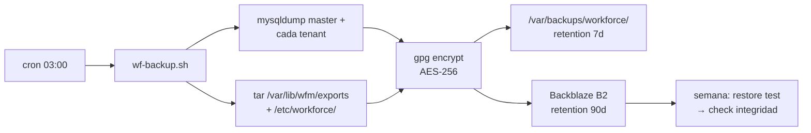

# Deployment — Workforce Manager

## 1. Opciones de despliegue

| Opción | Esfuerzo | Coste/mes | Recomendado para |
|---|---|---|---|
| **A. VPS Ubuntu + `install.sh`** | 15 min | 6-10 € | Producción single-tenant small, hasta 100 clientes/VPS |
| **B. Docker Compose** | 20 min | 5-15 € | Dev avanzado, staging, demos aisladas |
| **C. Cloudflare Tunnel desde PC local** | 5 min | 0 € | Dev público, demos clientes, soft-launch |
| **D. Hosting shared** | — | — | **Insuficiente** (ver abajo) |

---

## 2. Opción A — VPS Ubuntu 22+ (recomendada producción)

### Proveedores validados

| Proveedor | Plan mínimo recomendado | €/mes | RAM | Núcleos | Disco |
|---|---|---|---|---|---|
| Hetzner | CX22 | 5,83 € | 4 GB | 2 vCPU | 40 GB SSD |
| Hostinger | KVM 2 | 5,99 € | 4 GB | 2 vCPU | 60 GB NVMe |
| OVH | VPS SSD 2 | 7,99 € | 4 GB | 2 vCPU | 40 GB SSD |
| Contabo | VPS M | 8,49 € | 8 GB | 6 vCPU | 200 GB SSD |

**Hetzner CX22 es la recomendación por defecto** (relación precio/performance óptima para España).

### Procedimiento `install.sh`

```bash
# 1. Crear VPS Ubuntu 22.04 LTS + apuntar DNS A record workforce.midominio.com → IP VPS

ssh root@<IP_VPS>
apt update && apt install -y git

git clone https://github.com/gmermot/workforce-manager.git /opt/workforce-manager
cd /opt/workforce-manager/deploy/vps

./install.sh \
  --domain workforce.midominio.com \
  --email admin@midominio.com \
  --timezone Europe/Madrid
```

El script instala y configura **en 10-15 min**:

1. Apache 2.4 + mod_rewrite + mod_ssl + mod_headers.
2. PHP 8.3 con módulos: `php-mysql`, `php-mbstring`, `php-xml`, `php-curl`, `php-zip`, `php-intl`, `php-gd`.
3. MariaDB 10.11 con `innodb_file_per_table=ON`, `innodb_strict_mode=ON`.
4. wkhtmltopdf 0.12.6 (binary deb).
5. Composer para dependencias PHP.
6. Let's Encrypt via certbot (certificado wildcard si se pide).
7. UFW firewall (22/80/443 abiertos, resto bloqueado).
8. fail2ban con jails para SSH + Apache + login custom.
9. Cron de backup diario (03:00 local).
10. Logrotate para `/var/log/workforce/`.
11. Usuario `deploy` dedicado + llave SSH para despliegues.
12. Variables de entorno en `/etc/workforce/app.env` (permisos 0400).
13. Migraciones iniciales ejecutadas (master + seed roles/permissions).
14. Verificación final: curl `/api/health` → 200.

### Qué pide por consola el instalador

- Email para Let's Encrypt + alertas sistema.
- Nombre/email del primer `company_admin` (opcional).
- Password root MariaDB (random si no se da).
- Timezone (default Europe/Madrid).

### Idempotencia

- `install.sh` puede ejecutarse 2 veces: detecta estado y salta pasos ya hechos.
- Útil para actualizar: `git pull && ./install.sh --upgrade`.

---

## 3. Opción B — Docker Compose

```bash
cd deploy/docker
cp .env.example .env
nano .env  # ajustar passwords y domain

docker compose up -d
```

`docker-compose.yml` levanta:

- `apache-php83` (app).
- `mariadb` (datos persistentes en volumen).
- `wkhtmltopdf` (sidecar para PDFs).
- `backup` (sidecar que ejecuta `wf-backup.sh` vía cron interno).

Útil para **staging** y **demos aisladas**. En producción preferimos VPS directo por menor overhead y menos capas que debuggear.

---

## 4. Opción C — Cloudflare Tunnel desde PC local

Opción actual mientras validamos demanda:

```bash
# PC local, Apache + MariaDB ya instalados vía stack jornales
cloudflared tunnel --url https://localhost:443 \
  --no-tls-verify \
  --http-host-header workforce.test
```

Expone `workforce.test` local vía URL pública `*.trycloudflare.com`. Útil para enseñar a cliente antes de alquilar VPS.

Para producción real, mover a VPS vía opción A.

### Tunnel con nombre fijo

```bash
cloudflared tunnel create workforce-prod
cloudflared tunnel route dns workforce-prod workforce.workflow-cloud.com
cloudflared tunnel run workforce-prod
```

Permite subdominio permanente `workforce.workflow-cloud.com` apuntando a PC local. Latency aceptable para < 50 clientes.

---

## 5. Por qué no hosting shared

Hosting shared tipo Hostinger shared / Dinahosting / 1&1 **no sirve** para la app por:

- **No podemos crear bases de datos nuevas dinámicamente** (necesario cada vez que se da de alta una sub).
- **No podemos crear usuarios MySQL** con GRANTS específicos.
- **No podemos ejecutar wkhtmltopdf** (requiere binary + shared libs).
- **No podemos configurar fail2ban** ni control granular sshd.
- **No podemos installar extensiones PHP** faltantes (ej. `intl`).
- **Backups automatizados** limitados al panel del proveedor.
- **Logs sanitizados** no se pueden configurar al nivel que necesitamos.

**Excepción**: el **landing comercial** sí vive en Hostinger shared (`work-flow.solutions/workforce/`). Es HTML + 2 PHPs sencillos (signup + webhook Stripe) + SQLite. Ese sí funciona en shared.

El panel app (`/panel/`) redirige vía 302 al VPS/Cloudflare Tunnel.

---

## 6. DNS y SSL

### Registros DNS típicos

| Tipo | Nombre | Valor | TTL |
|---|---|---|---|
| A | `workforce.midominio.com` | IP VPS | 300 |
| CNAME | `www.workforce.midominio.com` | `workforce.midominio.com` | 300 |
| MX | `midominio.com` | mail provider | 3600 |
| TXT | `midominio.com` | `v=spf1 include:_spf.mx.hostinger.com ~all` | 3600 |
| TXT | `_dmarc.midominio.com` | `v=DMARC1; p=none; rua=mailto:dmarc@midominio.com` | 3600 |

### Let's Encrypt

- Certbot ejecuta `--apache` plugin.
- Renovación automática via cron (certbot renew --quiet).
- Alerta email 20 días antes expiración si falla.

---

## 7. Backup

### Estrategia



### Retención

- Local VPS: 7 diarios + 4 semanales.
- Remote B2: 7 diarios + 4 semanales + 12 mensuales + 2 anuales.
- Coste B2: ~0,005 $/GB/mes → 10 GB = 0,05 $/mes.

### Restore procedure

```bash
# 1. Descargar backup
./wf-restore.sh --date 2026-10-01 --tenant punjab701

# 2. Script:
#    - Descarga de B2
#    - Verifica firma GPG
#    - Descifra
#    - Confirma antes de dropear BD actual
#    - Restaura
#    - Verifica tenant_meta
```

---

## 8. Monitoring

### Uptime

- **UptimeRobot** (gratuito 5-min interval) → ping `/api/health` cada 5 min.
- Si down → alerta email + Telegram.

### Health check endpoint

`GET /api/health`:

```json
{
  "status": "ok",
  "version": "1.4.2",
  "db_master": "ok",
  "db_tenants_sample": "ok",
  "disk_free_pct": 78,
  "uptime_seconds": 1234567
}
```

Si cualquier chequeo falla → 503.

### Métricas (futuro)

- Prometheus + Grafana (opcional post-100-clientes).
- Métricas: req/sec por endpoint, latency p95, errores 5xx/min, tenants activos.

---

## 9. CI/CD propuesto

Hoy: deploy manual vía SSH + `git pull`.

Pipeline target (GitHub Actions):

```yaml
name: Deploy

on:
  push:
    branches: [main]

jobs:
  test:
    runs-on: ubuntu-22.04
    steps:
      - uses: actions/checkout@v4
      - name: Setup PHP 8.3
        uses: shivammathur/setup-php@v2
        with: { php-version: 8.3 }
      - run: composer install --no-dev
      - run: ./vendor/bin/phpunit

  deploy:
    needs: test
    runs-on: ubuntu-22.04
    steps:
      - uses: appleboy/ssh-action@v1
        with:
          host: ${{ secrets.VPS_HOST }}
          username: deploy
          key: ${{ secrets.DEPLOY_SSH_KEY }}
          script: |
            cd /opt/workforce-manager
            git pull origin main
            composer install --no-dev --optimize-autoloader
            ./deploy/vps/post-deploy.sh
```

`post-deploy.sh` ejecuta:

- Aplicar migraciones pendientes (idempotente).
- Clear cache (`cache/views/*`).
- Reload Apache (sin downtime).
- Smoke test `/api/health`.
- Rollback automático si smoke test falla.

---

## 10. Rollback

### Opción A — Git revert

```bash
cd /opt/workforce-manager
git revert HEAD
git push
# → trigger CI → redeploy
```

### Opción B — Restore full

Si una migración rompió datos:

```bash
./wf-restore.sh --date <ayer> --all
```

Downtime: ~5-10 min.

---

## 11. Checklist pre-producción

- [ ] DNS apunta a IP VPS correcta.
- [ ] Let's Encrypt instalado y renovación automática verificada.
- [ ] UFW activo con reglas mínimas.
- [ ] fail2ban activo con jails `sshd`, `apache-auth`, `workforce-login`.
- [ ] MariaDB sólo escucha en `127.0.0.1`.
- [ ] Cron backup activo (`crontab -l` muestra línea 03:00).
- [ ] Verificar primer backup funciona (ejecutar manual `wf-backup.sh`).
- [ ] Permisos `/etc/workforce/*.env` = 0400 owner www-data.
- [ ] Password root MariaDB cambiado del default.
- [ ] UptimeRobot configurado con URL + email alertas.
- [ ] Stripe webhook endpoint registrado con URL correcta.
- [ ] Email transaccional funciona (test `wf-cli send-test-email <email>`).
- [ ] Primer `company_admin` creado y acceso verificado.
- [ ] HSTS header verificado (`curl -I`).
- [ ] CSP header verificado.
