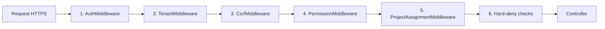

# Seguridad — Workforce Manager

## 1. Modelo multi-tenant físico

### ¿Qué significa "físico"?

Cada subcontrata tiene:

- **Su propia base de datos MariaDB**: `workforce_bloc_<slug>`.
- **Su propio usuario MySQL**: `wf_tenant_<slug>`.
- **Sus propios GRANTS**: `GRANT SELECT, INSERT, UPDATE, DELETE ON workforce_bloc_<slug>.* TO 'wf_tenant_<slug>'@'127.0.0.1'`.
- **Sin acceso cruzado**: el usuario `wf_tenant_punjab701` no puede listar la BD de `workforce_bloc_bloc`; MariaDB devuelve `Access denied` antes de ejecutar la query.

### ¿Por qué es superior a multi-tenant lógico?

En multi-tenant **lógico** (misma BD + columna `tenant_id`):

- Toda la app usa 1 usuario MySQL con GRANTS sobre todas las tablas.
- Un `WHERE tenant_id = ?` olvidado = fuga de datos silenciosa.
- Un bug SQL injection = acceso a todos los tenants.
- Un error en el ORM = devuelve filas ajenas.

En multi-tenant **físico** (nuestro modelo):

- Cada request usa el PDO del tenant correcto (resuelto desde sesión, nunca desde HTTP).
- Si un atacante logra ejecutar SQL arbitrario sobre el PDO de Punjab, MariaDB le niega acceso a cualquier otra BD.
- Imposible leer datos ajenos por bug SQL — la capa de permisos MySQL es la última barrera.
- Backups por tenant: restaurar uno no afecta a otros.
- Export por tenant: cumplir RGPD de un cliente no requiere filtrar entre millones de filas.

Ejemplo verificación en producción (usuario Punjab intentando leer datos de BLOC):

```sql
mysql -u wf_tenant_punjab701 -p
> SELECT * FROM workforce_bloc_bloc.workers;
ERROR 1142 (42000): SELECT command denied to user 'wf_tenant_punjab701'@'127.0.0.1' for table 'workers'
> SHOW DATABASES;
+----------------------------+
| Database                   |
+----------------------------+
| information_schema         |
| workforce_bloc_punjab701   |
+----------------------------+
```

MariaDB ni siquiera lista las otras BDs. Para `wf_tenant_punjab701`, el resto del sistema no existe.

---

## 2. Cadena de middleware (6 capas)

Cada request HTTP atraviesa esta cadena antes de llegar al controlador:



### 2.1 AuthMiddleware

- Exige cookie de sesión válida (`wfm_sid`).
- Verifica `$_SESSION['user_id']` + fingerprint (user_agent hash parcial).
- Timeout sesión: 24 h actividad o 7 días absolute max.
- Si falla → 401, redirect `/login.html`.

### 2.2 TenantMiddleware

- Resuelve `$tenant` desde `$_SESSION['subcontractor_id']` o `$_SESSION['company_id']`.
- **NUNCA** desde query string, body ni header HTTP.
- Carga credenciales tenant desde `/etc/workforce/tenants/<slug>.env` (permisos 0400, owner www-data).
- Crea PDO del tenant con `PDO::ATTR_EMULATE_PREPARES = false`, `PDO::ATTR_ERRMODE = EXCEPTION`.
- Verifica `tenant_meta.master_subcontractor_id` coincide con el `subcontractor_id` esperado → `TenantMismatchException` si no.
- Inyecta PDO en el container (`$container->instance('tenant.pdo', $pdo)`).

### 2.3 CsrfMiddleware

- Obligatorio en `POST`, `PUT`, `PATCH`, `DELETE`.
- Token rotativo almacenado en `$_SESSION['csrf_token']`, rotado cada 10 min.
- Comparación con `hash_equals()` (timing-attack-safe).
- Si falla → 403 `csrf_token_invalid`.

### 2.4 PermissionMiddleware

- Carga matriz `role × action` desde `master.role_permissions` (cacheada en memoria).
- Para cada endpoint sabe la acción requerida: `jornal.create`, `proforma.approve`, etc.
- Si no está permitido → 403 `permission_denied`.

### 2.5 ProjectAssignmentMiddleware

- Para subcontratas: verifica que el `project_id` del request está en `project_subcontractor_assignments` para esta sub.
- Si una sub intenta meter jornales en una obra que no le han asignado → 403.

### 2.6 Hard-denies específicos

Reglas que no se delegan a la matriz, codificadas directamente:

| Rol | Acción | Resultado |
|---|---|---|
| company_* | jornal.update | DENY hard (empresa solo observa, no edita) |
| subcontractor_* | proforma.approve | DENY hard (sub no aprueba su propia proforma) |
| subcontractor_* | subcontractor.read si id != self | DENY hard |
| subcontractor_* | project.read si project no asignado | DENY hard |
| cualquiera | tenant.switch sin permiso explícito | DENY hard |

---

## 3. Contraseñas y sesiones

- **Hash**: `password_hash($password, PASSWORD_BCRYPT, ['cost' => 12])`.
- **Verificación**: `password_verify()`.
- **Anti-timing attack**: si el usuario no existe, se ejecuta `verifyDummy()` con un hash dummy del mismo coste → tiempo de respuesta constante.
- **Política mínima**: 10 chars, no exigimos símbolos específicos (NIST SP 800-63B compliant).
- **Rotación obligatoria**: no. Pedir rotación periódica reduce entropy real.
- **Breach check**: integración futura con HIBP API para avisar si password aparece en un leak conocido.

### Sesiones

- Cookie `wfm_sid`:
  - `HttpOnly` ✓
  - `Secure` ✓ (solo HTTPS)
  - `SameSite=Lax` ✓
  - `Path=/`
- Session_regenerate_id al login y al cambio de privilegio.
- Hash fingerprint parcial (user_agent + accept_language) → si cambia drásticamente → logout forzado.
- Rate limiting: 5 fallos en 15 min por (ip, email) → 423 con `Retry-After`.

---

## 4. Protección contra inyección

### SQL Injection

- **PDO con prepared statements reales** siempre.
- `PDO::ATTR_EMULATE_PREPARES = false` (clave: desactiva emulación cliente-side).
- **Nunca** concatenación de strings en queries, **nunca** `exec($pdo->exec(...))` con input user.
- Testing: fuzzing automatizado en CI con cadenas tipo `' OR 1=1--`, `UNION SELECT`, etc.

### XSS

- **Output escaping obligatorio** en templates: función `e()` helper.
- CSP headers:
  ```
  Content-Security-Policy: default-src 'self'; script-src 'self'; style-src 'self' 'unsafe-inline'; img-src 'self' data:; connect-src 'self' https://api.stripe.com;
  ```
- X-Frame-Options: SAMEORIGIN.
- X-Content-Type-Options: nosniff.

### CSRF

- Ya explicado arriba (middleware).

### Open Redirect

- Lista blanca de URLs permitidas en redirects post-login.
- Nunca redirect a URL completa desde query param.

---

## 5. RGPD / LOPD

### Consentimientos

- Al signup se piden explícitamente **2 checkboxes separados**:
  - Términos y condiciones.
  - Política de privacidad.
- Se guarda **irreversiblemente**:
  - `consent_ip` (IP del request).
  - `consent_ua` (User-Agent completo).
  - `consent_at` (timestamp UTC).
  - `accepted_terms` (0 o 1).
  - `accepted_privacy` (0 o 1).

### Derecho de acceso

- Endpoint `GET /api/users/me/export` genera ZIP con:
  - CSV de datos personales del user.
  - CSV de todos los jornales creados por el user.
  - CSV de todas las observaciones del user.
  - JSON manifest con metadata.

### Derecho al olvido

- Endpoint `DELETE /api/users/me`:
  - Anonymizes nombre, email, phone (nulos o `[deleted]`).
  - Conserva FKs para integridad (jornales siguen existiendo pero sin autor identificable).
  - Marca `status='deleted'` y bloquea login futuro.
  - Log inmutable en `activity_log` con hash del user_id borrado.

### Minimización

- No pedimos datos innecesarios. No pedimos fecha nacimiento, dirección casa, estado civil, etc.
- NIE/DNI operario → opcional (puede dejarse en blanco).

### Encriptación en tránsito

- Let's Encrypt obligatorio en producción.
- HSTS header con max-age 31536000.
- TLS 1.2 mínimo, TLS 1.3 preferido.

### Encriptación en reposo

- Backups cifrados con GPG (AES-256) antes de subir a S3/B2.
- Base de datos sin cifrado at-rest por defecto (MariaDB soporta `innodb_encrypt_tables` como opcional premium).

### DPO y registro de actividades

- Workflow Cloud LLC designa a Gustavo Mermot como responsable de privacidad.
- Registro de actividades de tratamiento documentado (RAT) en `/docs/rgpd/rat.md`.
- Contactos: privacy@workflow-cloud.com (pendiente alias).

---

## 6. Logs y auditoría

### Qué se loguea

- Todos los accesos a `/api/*` → access log Apache (sanitized).
- Todas las acciones de escritura → tabla `activity_log` por tenant.
- Login/logout, fallos de login → `master.login_attempts`.
- Errores PHP → `/var/log/workforce/php-errors.log` (sanitized passwords/tokens).

### Qué NO se loguea (sanitización)

- Passwords plain text.
- Tokens de sesión (sólo primeros 6 chars).
- Tokens de reset password.
- Stripe webhook signatures.
- Keys API en logs de error.

Función `logSanitize($data)` recorre el array y aplica mask a keys: `password`, `token`, `secret`, `api_key`, `authorization`, `cookie`, `csrf_token`.

### Retención logs

- Access log Apache: 90 días rotación logrotate.
- `activity_log`: 24 meses (particionado mensual, drop automático).
- `login_attempts`: 90 días.

---

## 7. GRANTS MySQL ejemplo real

Script `wf-provision-tenant.sh` ejecuta por cada nueva sub:

```sql
-- Master DBA (ejecuta esto)
CREATE DATABASE IF NOT EXISTS `workforce_bloc_punjab701`
  CHARACTER SET utf8mb4
  COLLATE utf8mb4_unicode_ci;

-- Usuario dedicado
CREATE USER 'wf_tenant_punjab701'@'127.0.0.1'
  IDENTIFIED BY '<RANDOM_32_CHARS_HEX>';

-- GRANTS limitados
GRANT SELECT, INSERT, UPDATE, DELETE, LOCK TABLES, EXECUTE
  ON `workforce_bloc_punjab701`.*
  TO 'wf_tenant_punjab701'@'127.0.0.1';

-- Explícitamente NO:
-- - CREATE, DROP, ALTER (los hace wf_dba durante migraciones)
-- - FILE, PROCESS, SUPER
-- - GRANTS en otras BDs

FLUSH PRIVILEGES;
```

El password aleatorio se guarda en `/etc/workforce/tenants/punjab701.env`:

```bash
TENANT_DB_HOST=127.0.0.1
TENANT_DB_PORT=3306
TENANT_DB_NAME=workforce_bloc_punjab701
TENANT_DB_USER=wf_tenant_punjab701
TENANT_DB_PASSWORD=aB3xZ7qK9vF2hT8nR4mP6cL1wE5sY0jU
```

Permisos: `-r-------- 1 www-data www-data`.

---

## 8. Infraestructura (VPS producción)

### Firewall UFW

```
Status: active
To                         Action      From
22/tcp (LIMIT)             ALLOW IN    Anywhere      # ssh con rate-limit
80/tcp                     ALLOW IN    Anywhere      # redirect to 443
443/tcp                    ALLOW IN    Anywhere      # app
3306                       DENY        Anywhere      # MariaDB solo localhost
```

### fail2ban

Jails activos:

- `sshd` (default)
- `apache-auth` (401 brute force → ban 1h tras 5 fallos)
- `apache-badbots` (user-agents maliciosos)
- `workforce-login` (jail custom lee `/var/log/workforce/login-attempts.log`)

### SSH

- Solo auth por **key**, no password.
- Puerto 22 default (fail2ban + ufw rate limit lo protegen).
- Root login: `PermitRootLogin prohibit-password`.
- Usuario deploy dedicado: `deploy`.

### Backup

- Script `wf-backup.sh` corre a las 03:00 vía cron.
- Dump por tenant → GPG encrypt → upload Backblaze B2.
- Verificación: 1/semana restore automático en VPS staging + diff integridad.

---

## 9. Vulnerabilidades conocidas y mitigaciones

### Riesgo: suspensión LLM auto-fill crea user admin

- Mitigación: la ruta `/activation/{code}` requiere código único con TTL 7d, consume al usar.
- Siguiente iteración: añadir captcha v2 invisible (Cloudflare Turnstile).

### Riesgo: timing attack para enumerar emails en forgot-password

- Mitigación: respuesta siempre 200 con mensaje genérico. No se diferencia user existente de inexistente.

### Riesgo: webhook Stripe spoofing

- Mitigación: validación de firma `Stripe-Signature` con secret del endpoint. Rechazo con 401 si no cuadra.

### Riesgo: DoS layer-7 sobre `/api/*`

- Mitigación corto plazo: rate limiting por usuario (ver API.md).
- Mitigación medio plazo: Cloudflare delante del VPS (ya habilitado durante Cloudflare Tunnel).

---

## 10. Pentesting y auditoría

- **Interno**: review manual anual del código, foco en controllers nuevos y queries.
- **Externo**: contratación de pentest profesional cuando ARR > 100 K€ (año 2 según proyección).
- **Bug bounty informal**: `security@workflow-cloud.com` acepta reports; reconocimiento público en `SECURITY.md`.
